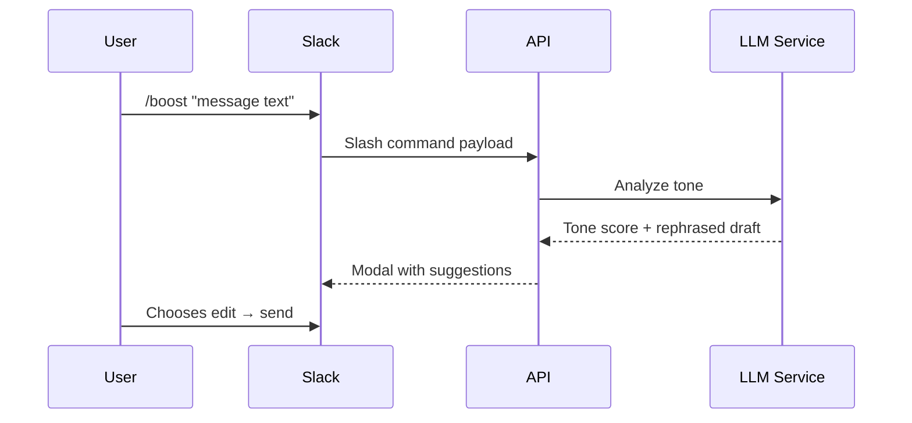
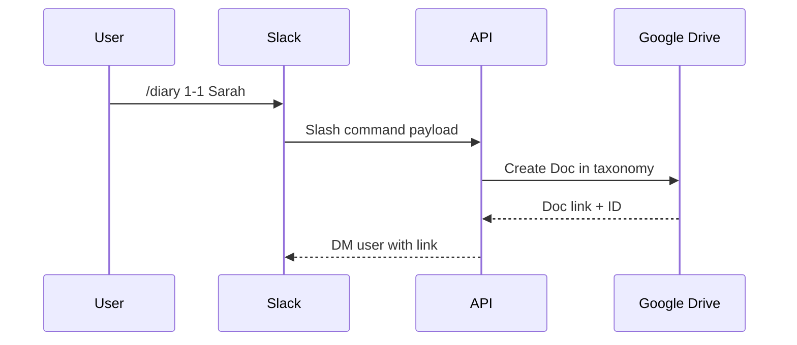
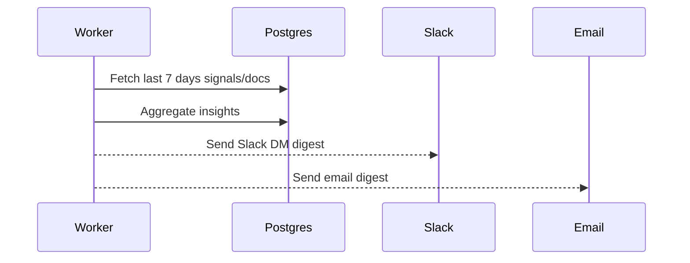

# mgmt-boost — System Design (Expanded)

**Purpose**  
A Slack-first manager augmentation app: message boosters, diary/notes to Google Drive, lightweight team pulse signals, and weekly digest. It acts as a manager’s co-pilot — helping leaders stay productive, empathetic, and consistent — without adding another heavy tool.

**Design goals**
- Live inside Slack (primary) and email (digest).
- Zero/minimal UI outside existing tools.
- Store minimal data; user owns notes in Google Drive.
- Ephemeral processing of raw content; persist only metadata/derived signals.
- Lightweight MVP, but extensible to enterprise needs.

---

## 1) High-Level Architecture

```
Clients
 ├─ Slack (slash commands, modals, DMs, event subscriptions)
 ├─ Email (weekly digest via worker + SES/SendGrid)
 └─ (Phase 2+) Zoom, Jira, GitHub integrations

Backend
 ├─ API Gateway (HTTPS, auth, request verification)
 ├─ Command Handlers (Slack commands, diary, booster, nav)
 ├─ LLM/Tone Service (rephrase, score, suggest; stateless)
 ├─ Integration SDK (Slack API, Google Drive/Docs, Zoom, Jira)
 ├─ Workers (queues: signals, digests, nudges, schedulers)
 └─ Rules Engine (nudges prioritization + business logic)

Data
 ├─ Postgres (users, oauth tokens, doc index, signals, nudges)
 ├─ Redis (caching, rate limiting, ephemeral storage)
 └─ Object store: none (notes live in Google Drive)

External APIs
 ├─ Slack API
 ├─ Google Drive/Docs API
 ├─ (Later) Zoom API, Jira API, GitHub API
```

---

## 2) Core Components

- **API Gateway**  
  - Verifies Slack request signatures.  
  - Routes to correct command handlers.  
  - Handles OAuth callback flows for Slack & Google.  

- **Command Handlers**  
  - `/boost`: analyze message tone → suggest edits.  
  - `/diary`: create/link Google Doc with taxonomy.  
  - `/nav`: quick links to past notes.  
  - `/summary`: daily/weekly digest triggers.  

- **LLM/Tone Service**  
  - Stateless microservice.  
  - Inputs: message text. Outputs: tone score, rephrased draft.  
  - Guardrails: never auto-send, only advise.  

- **Workers**  
  - Process async tasks from queue.  
  - Signals ingestion (from Slack/Zoom/Jira/GitHub).  
  - Digest builder (weekly team overview).  
  - Nudge engine (gap detection + proactive prompts).  

- **Rules Engine**  
  - Defines when nudges trigger.  
  - Examples:  
    - “Team quiet 3+ days.”  
    - “Release shipped last week — recognition overdue.”  
    - “1:1 cadence slipping with direct report.”  

- **Integrations SDK**  
  - Slack: commands, events, modals, DM delivery.  
  - Google Drive/Docs: folder creation, doc linking, permissions.  
  - Zoom/Jira/GitHub: meeting transcripts, tickets closed, PRs merged.  

---

## 3) Data Model

Only **metadata + signals** are stored. Raw notes/content remain in Google Drive.  

```sql
users(
  id UUID PK,
  email TEXT,
  slack_user_id TEXT,
  google_sub TEXT,
  prefs JSONB,
  created_at TIMESTAMP
)

oauth_tokens(
  id UUID PK,
  user_id UUID FK,
  provider TEXT,
  access_token TEXT ENCRYPTED,
  refresh_token TEXT ENCRYPTED,
  expiry TIMESTAMP
)

docs_index(
  id UUID PK,
  user_id UUID FK,
  file_id TEXT,
  doc_type TEXT,     -- daily, 1-1, retro, meeting
  title TEXT,
  path TEXT,
  person TEXT,
  date DATE,
  tags TEXT[]
)

signals(
  id UUID PK,
  user_id UUID FK,
  source TEXT,       -- slack, zoom, jira
  signal_type TEXT,  -- sentiment, activity, milestone
  value JSONB,
  payload JSONB,
  ts TIMESTAMP
)

insights(
  id UUID PK,
  user_id UUID FK,
  category TEXT,     -- morale, productivity, communication
  summary TEXT,
  strength INT,
  related_doc_id UUID,
  created_at TIMESTAMP
)

nudges(
  id UUID PK,
  user_id UUID FK,
  type TEXT,         -- recognition, unblock, cadence
  message TEXT,
  status TEXT,       -- sent, dismissed, snoozed
  sent_at TIMESTAMP,
  metadata JSONB
)
```

---

## 4) Google Drive Taxonomy

- **Root folder**: `/mgmt-boost Manager Diary/`  
- **Subfolders**: `/Daily/`, `/1-1s/`, `/Meetings/`, `/Retros/`  

**Naming convention examples:**  
- `2025-08-17_Daily_Log`  
- `2025-08-17_1-1_Sarah`  
- `2025-08-17_Retro`  

**Indexing**  
- Each new doc is indexed in `docs_index` table.  
- Linked to user for quick retrieval.  
- Slack `/nav` command pulls from index.  

---

## 5) Key Flows

### Sequence — Message Boost


### Sequence — Diary Entry


### Sequence — Weekly Digest


---

## 6) Security & Privacy

- **Data Minimization**: raw content never stored.  
- **OAuth Scopes**: only Slack commands + Drive folder access.  
- **Encryption**: all tokens encrypted at rest.  
- **Ephemeral Processing**: LLM receives text, returns result, input discarded.  
- **Org Adoption**: enterprise mode runs inside VPC with customer-managed keys.  
- **Threat Model**:  
  - Slack injection attacks → mitigate via request signing.  
  - Google Drive data leakage → scoping to single folder.  
  - Excess nudges → throttle to 1–2/day.  

---

## 7) Deployment

**MVP Setup**  
- Monolithic API + worker in containers.  
- Managed Postgres (RDS/Cloud SQL).  
- Redis for caching.  
- Worker scheduler for digests.  
- Secrets in Secret Manager.  
- Deploy to GCP/AWS Heroku-equivalent.  

**Scaling Path**  
- Split LLM service as separate microservice.  
- Move workers into dedicated queue system (Pub/Sub, SQS).  
- Horizontal scale API.  
- Enterprise: deploy to customer VPC.  

---

## 8) Roadmap

- **MVP**  
  - `/boost`, `/diary`, weekly digest.  
  - Basic nudges (quiet team, missed recognition).  

- **Phase 2**  
  - Zoom transcript ingestion.  
  - Jira issue close signals.  
  - GitHub PR merged signals.  
  - Recognition streaks.  
  - Sentiment scoring on retros.  

- **Phase 3**  
  - Web dashboard with graphs.  
  - AI coach mode (scenario-based nudges).  
  - Enterprise multi-tenant with SSO/SAML.  

---

## 9) Open Questions

- Retention: 30 vs 90 days for signals?  
- Should diary offer templates/prompts or stay free-form?  
- AI autonomy: do we allow auto-sent nudges, or advisory only?  
- Add lightweight web viewer for docs index?  
- Which integrations are critical for Phase 2 (Zoom vs Jira vs GitHub)?  

---

## 10) API Contract Examples

### Boost Request
```json
POST /api/boost
{
  "user_id": "123",
  "text": "Hey team can you fix this ASAP?"
}
```

**Response**
```json
{
  "tone_score": -0.4,
  "suggestions": [
    "Hey team, could we prioritize this today?",
    "Flagging this as urgent — thanks for jumping on it."
  ]
}
```

### Diary Creation
```json
POST /api/diary
{
  "user_id": "123",
  "doc_type": "1-1",
  "person": "Sarah"
}
```

**Response**
```json
{
  "doc_id": "1A2B3C",
  "doc_url": "https://docs.google.com/...",
  "title": "2025-08-17_1-1_Sarah"
}
```

---

## 11) Operational Concerns

- **Logging**: request ID correlation; no raw message logs.  
- **Monitoring**: latency on boost requests, digest delivery success.  
- **Error Handling**: Slack retry logic, exponential backoff.  
- **Analytics**: track boost usage, diary creation, digest reads (only counts, not content).  

---
